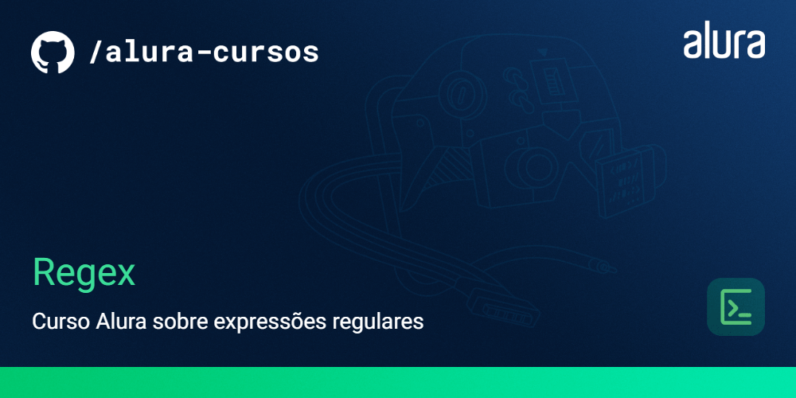

# Curso Alura - Expressões Regulares

Este repositório contém material do curso sobre Expressões Regulares. As expressões regulares, frequentemente chamadas de "regex" ou "regexp", são poderosas ferramentas para busca, validação e manipulação de texto. Este curso visa fornecer uma introdução abrangente e prática ao mundo das expressões regulares.

## Como Usar

Clone este repositório para sua máquina local:

   ```shell
   git clone https://github.com/camilapessoa/regex_curso.git
```
## Ferramentas
- Node.js
- Google Collab python
- JavaScript
- HTML
- CSS